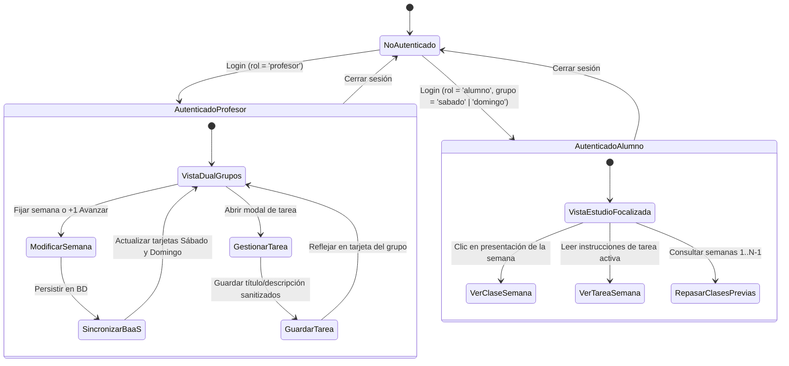

# Phase 1 Data Model: Rediseño de Paneles Académicos y Seguridad

Este documento describe las entidades de datos, esquemas de tipos, estados y reglas de validación involucradas en el rediseño de los paneles de profesor y estudiante, así como las funciones de seguridad.

---

## 1. Entidades Principales

### `GrupoAcademico` (Grupo)
Representa una de las dos cohortes activas en el plantel escolar.

- **Identificador (`id`)**: `'sabado' | 'domingo'`
- **Nombre (`nombre`)**: `'Clase Sábado' | 'Clase Domingo'`
- **Día (`dia`)**: `'Sábado' | 'Domingo'`
- **Horario (`horario`)**: Cadena de texto informativa, ej. `'09:00 – 13:00 h'`
- **Semana Actual (`semanaActual`)**: Número entero entre $1$ y $54$.

**Reglas de validación**:
- $1 \le \text{semanaActual} \le 54$.
- No se permiten valores nulos o cadenas vacías.
- Mutación restringida exclusivamente a usuarios con rol `profesor`.

---

### `ClaseSemanal` (Plan de Estudios)
Elemento del currículo correspondiente a una semana específica (proveniente de `src/data/plan-estudios.ts`).

- **Semana (`semana`)**: Número entero $1 \dots 54$.
- **Módulo (`moduloNumero`)**: Número entero del módulo formativo.
- **Módulo Texto (`moduloNumeroStr`)**: Cadena formateada, ej. `'01'`.
- **Módulo Título (`moduloTitulo`)**: Cadena, ej. `'Fundamentos y Mantenimiento de Equipos de Cómputo'`.
- **Clase Título (`claseTitulo`)**: Nombre de la lección, ej. `'Arquitectura de la PC y Componentes Internos'`.
- **Clase Descripción (`claseDescripcion`)**: Síntesis pedagógica de la sesión.
- **Tipo de Clase (`claseTipo`)**: `'laboratorio' | 'proyecto' | 'evaluacion' | 'teorica_practica'`.
- **Slug de Lección (`slug`)**: Ruta opcional hacia la presentación `.mdx` asociada (ej. `'01-fundamentos-y-mantenimiento/01-introduccion/01-clase'`), o `null` si es sesión de taller sin presentación.

---

### `TareaSemanal` (Tarea)
Asignación de estudio o investigación teórica creada por el profesor para una semana y grupo determinados.

- **ID (`id`)**: Cadena con formato `${groupId}-${semana}`, ej. `'sabado-4'`.
- **Grupo (`grupo`)**: `'sabado' | 'domingo'`.
- **Semana (`semana`)**: Número entero $1 \dots 54$.
- **Título (`titulo`)**: Cadena no vacía (máximo 120 caracteres, texto plano sanitizado).
- **Descripción (`descripcion`)**: Contenido de la tarea (máximo 1000 caracteres, texto plano sanitizado).
- **Fecha de Entrega (`fechaEntrega`)**: Cadena descriptiva opcional (ej. `'Inicio de la próxima sesión (09:00 h)'`).
- **Fecha de Actualización (`actualizadaEn`)**: Marca de tiempo ISO-8601.

**Reglas de validación**:
- Título y descripción no deben contener código HTML no escapado al renderizarse.
- La eliminación de una tarea purga el registro de `tareas[id]` en la base de datos local y remota.

---

### `UsuarioPortal` (Usuario)
Identidad activa en la sesión del portal.

- **ID (`id`)**: Identificador único (`'u_prof'`, `'u_sab_01'`, etc.).
- **Nombre (`nombre`)**: Nombre completo del alumno o profesor.
- **Rol (`rol`)**: `'profesor' | 'alumno'`.
- **Grupo (`grupo`)**: Opcional para profesor; obligatorio `'sabado' | 'domingo'` para alumnos.
- **Clase (`clase`)**: Sinónimo de grupo para compatibilidad histórica.
- **Usuario (`username`)**: Nombre de usuario único para inicio de sesión (ej. `'erandi.alvarado'`).
- **Matrícula (`matricula`)**: Identificador escolar único (ej. `'SAB-01'`).

---

## 2. Transiciones de Estado y Ciclo de Vida

---

## 3. Políticas de Sanitización y Seguridad (OWASP)

1. **Escape HTML al Renderizar**:
   Toda interpolación dinámica que se realice en el DOM (`innerHTML`) debe pasar por una función de escape que reemplace:
   - `&` por `&amp;`
   - `<` por `&lt;`
   - `>` por `&gt;`
   - `"` por `&quot;`
   - `'` por `&#x27;`
   - `/` por `&#x2F;`

2. **Control de Acceso Funcional**:
   Las funciones `updateWeek`, `saveTask`, `deleteTask` y `updateGrade` verifican que el usuario en sesión cuente con `rol === 'profesor'`. Si un usuario con rol de estudiante ejecuta scripts locales o dispara eventos indebidos, la mutación se bloquea.
