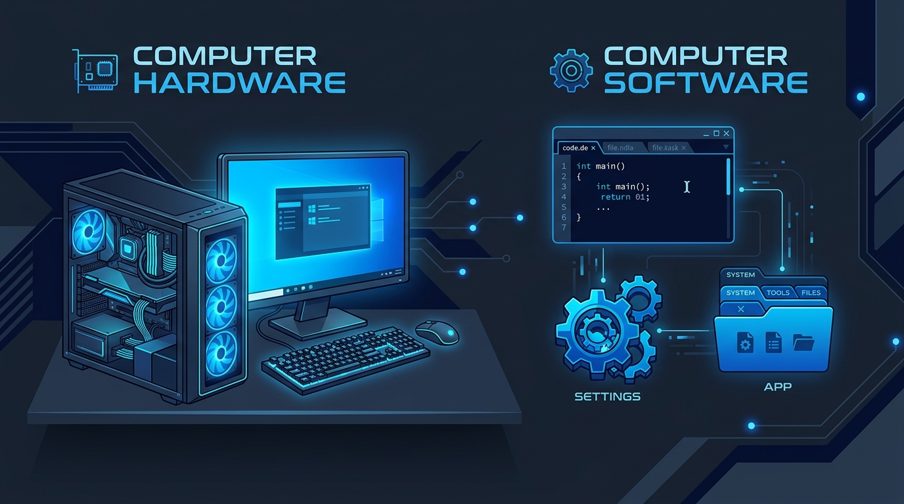

# Hardware y Software

## 1. ¿Qué es Hardware? 🛠️

Es la parte **física** de la computadora. Todo lo que puedes tocar, conectar y desarmar.

- **Procesador (CPU):** El cerebro que piensa.
- **Memoria RAM:** La mesa de trabajo (borrable y rápida).
- **Almacenamiento (SSD/HDD):** El cajón donde guardas tus archivos para siempre.
- **Periféricos:** Lo que usas para interactuar (Mouse, teclado, pantalla, audífonos).

> 💡 **En resumen:** Si lo puedes patear cuando no funciona, es Hardware.

---

## 2. ¿Qué es Software? 💻

Es la parte **lógica** e intangible. Las instrucciones, códigos y programas que le dicen al hardware qué hacer.

- **Sistemas Operativos:** Windows, Linux, macOS, Android. (El jefe).
- **Aplicaciones:** Discord, Spotify, Google Chrome.
- **Videojuegos:** Minecraft, Roblox, Fortnite.

> 💡 **En resumen:** Si sólo lo puedes insultar cuando falla, es Software.

---

## 🛠️ Actividad Práctica: "Radiografía Digital"

Vamos a ver cómo interactúan en tiempo real en tu propia computadora.

1. Abre el **Administrador de Tareas** (o Monitor del Sistema) presionando `Ctrl + Shift + Esc`.
2. Ve a la pestaña de **Rendimiento** (Performance).
3. **El Reto:** \* Observa el porcentaje de uso de tu **CPU** y **RAM**.
   - Abre 5 pestañas de YouTube al mismo tiempo en tu navegador.
   - ¿Qué componente de Hardware empezó a sufrir o a subir su porcentaje de uso?
